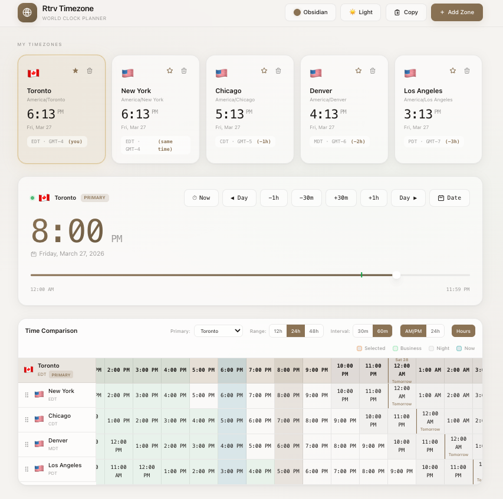

<div align="center">

# 🌍 Rtrv Timezone

**Modern world clock & timezone planner** — compare times, plan meetings, visualize working hours overlap.

Built for remote teams, global collaborators, and travelers. Available as a **web app** and **Chrome extension**.

[](https://react.dev/) [](https://www.typescriptlang.org/) [](https://vitejs.dev/) [](https://tailwindcss.com/) [](#-docker) [](https://opensource.org/licenses/MIT) [](#-chrome-extension)
</div>

---

<p align="center">
  
</p>

<p align="center">
  
</p>

---

## ✨ Features

| Feature | Description |
|---------|-------------|
| 🌐 **Multi-Timezone** | Add and compare unlimited timezones side-by-side |
| 🎚️ **Time Slider** | Drag to shift time across all zones instantly |
| 📊 **Time Grid** | Visual comparison with business/night hour shading |
| 📅 **Date & Time Picker** | Jump to any date or exact time |
| 🎨 **5 Color Themes** | Obsidian, Midnight, Graphite, Crimson, Emerald |
| 🌓 **Light / Dark Mode** | Per-theme palettes with system preference detection |
| 🔍 **Smart Search** | Search by city, country, timezone, or abbreviation |
| 🏷️ **Relative Time** | Shows "3h ahead" / "5h behind" vs primary zone |
| ⭐ **Set Primary Zone** | Star any timezone as the reference |
| 📋 **Copy & Export** | One-click copy of time summary to clipboard |
| 🔔 **Toast Notifications** | Contextual feedback for all actions |
| 🫧 **Glassmorphism UI** | Frosted glass cards, mesh gradients, ambient orbs |
| 🖱️ **Drag to Reorder** | Rearrange timezone cards and grid rows |
| 🕐 **Auto-Detect Timezone** | Primary zone auto-detected on first visit |
| 💾 **Persistent Storage** | All settings saved to localStorage |
| 📱 **Responsive** | Adaptive grid layout for any screen size |
| 🧩 **Chrome Extension** | Replaces your new tab page |

---

## 📋 Release Notes

### v1.1.0

**New Features**
- Date picker — jump to any date
- Time picker — set an exact time
- Smart timezone search (city, country, abbreviation)
- Relative time labels ("3h ahead", "5h behind")
- Copy/export time summary to clipboard
- Toast notification system
- Auto-detect user's timezone on first visit
- Empty state with guided onboarding
- Drag-to-reorder timezone cards and grid rows

**UI Enhancements**
- 5 color themes: Obsidian, Midnight, Graphite, Crimson, Emerald
- Full light + dark mode palette per theme
- Theme picker dropdown in header
- Glassmorphism redesign — frosted glass, mesh gradients, ambient orbs
- Responsive grid layout for timezone cards
- Modal enter/exit animations
- Now vs Selected column colors clearly differentiated (teal vs accent)

---

## 🚀 Quick Start

```bash
git clone <repository-url>
cd rtrv_timezone
npm install
npm run dev
```

Open [http://localhost:5173](http://localhost:5173).

---

## 🐳 Docker

```bash
docker build -t rtrv-timezone .
docker run -d -p 8080:80 rtrv-timezone
```

Open [http://localhost:8080](http://localhost:8080).

---

## 🛠️ Tech Stack

- **React 19** + **TypeScript 5.9** + **Vite 7**
- **Tailwind CSS 4** — utility-first styling
- **Luxon** — timezone & datetime operations
- **localStorage** — persistent settings

---

## 📁 Project Structure

```
src/
├── components/
│   ├── Header.tsx            # Logo, theme toggle, theme picker, actions
│   ├── TimeSlider.tsx        # Primary time adjustment slider
│   ├── TimezoneCards.tsx     # Timezone card grid with drag-reorder
│   ├── TimeGrid.tsx          # 24h comparison grid with controls
│   ├── AddTimezoneModal.tsx  # Search & add timezones
│   ├── DateTimePickers.tsx   # Date picker & time picker modals
│   ├── ThemePicker.tsx       # Color theme selector dropdown
│   └── ToastContainer.tsx    # Toast notification stack
├── context/
│   ├── AppContext.tsx         # Global state (useReducer)
│   └── ThemeContext.tsx       # Light/dark + color theme
├── utils/
│   ├── timezone.ts           # Timezone helpers & slot generation
│   ├── storage.ts            # localStorage persistence
│   └── themes.ts             # 5 color theme definitions
├── App.tsx
├── index.css                 # Glass design system & CSS variables
└── main.tsx
```

---

## 💻 Development

```bash
npm run dev              # Dev server
npm run build            # Production build
npm run build:extension  # Chrome extension build
npm run preview          # Preview production
npm run lint             # Lint
```

---

## 🧩 Chrome Extension

Replaces your new tab with Rtrv Timezone.

1. `npm run build:extension`
2. Go to `chrome://extensions/` → enable **Developer mode**
3. Click **Load unpacked** → select `src/chromeExtension`
4. Open a new tab

See [src/chromeExtension/README.md](src/chromeExtension/README.md) for details.

---

## 🤝 Contributing

1. Fork → branch → commit → push → PR

---

## 📄 License

MIT — see [LICENSE](LICENSE).

---

<div align="center">

**Made with ❤️ by Rtrv**

[⬆ Back to top](#-rtrv-timezone)

</div>
