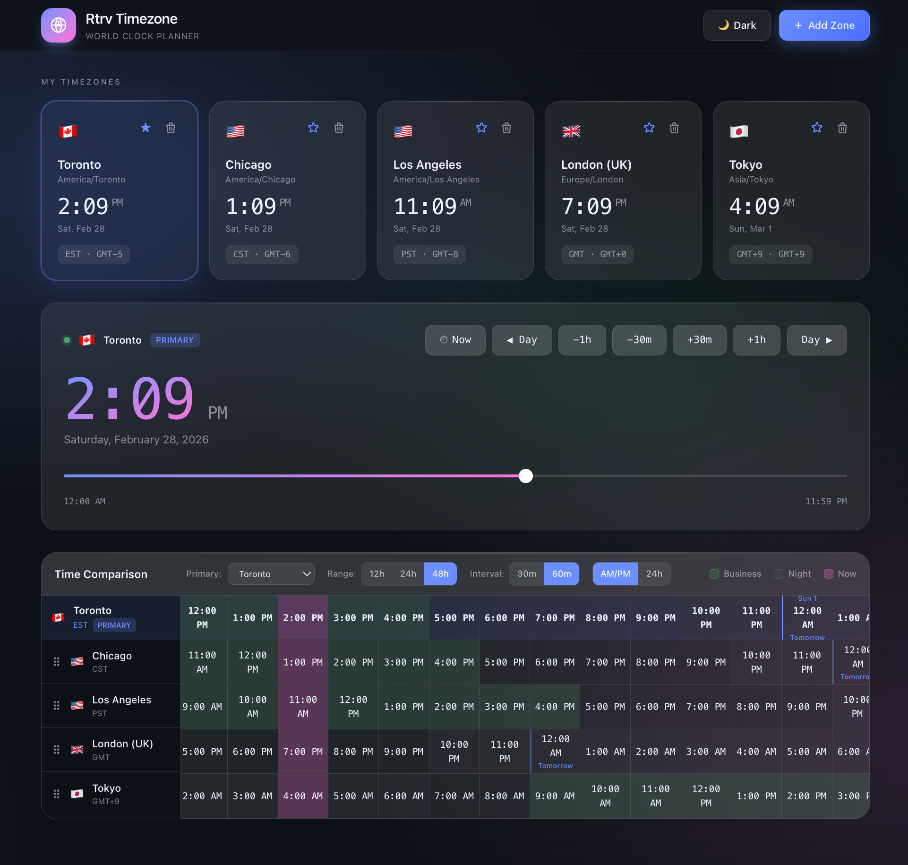

# Rtrv Timezone - Chrome Extension

A beautiful glassmorphism world clock planner that replaces your Chrome new tab page. Compare times across multiple timezones with an elegant, modern interface.




## Features

- 🌍 **Full World Clock Planner** - The complete web app as your new tab page
- 📊 **Time Comparison Grid** - Compare multiple timezones side-by-side
- ⏱ **Time Slider** - Navigate through time with the intuitive primary zone slider
- 🎨 **Light/Dark Themes** - Beautiful glassmorphism design that auto-detects system preference
- 💾 **Persistent Storage** - Your timezones and preferences are saved locally
- 🏢 **Business Hours** - Visual indicators for business hours (9 AM - 5 PM)
- 🌙 **Night Hours** - Visual indicators for night time (10 PM - 6 AM)
- 🔄 **Drag & Drop** - Reorder your timezones easily

## Installation

### Method 1: Load Unpacked Extension (Developer Mode)

1. **Build the extension** (if not already built):
   ```bash
   cd /path/to/rtrv_timezone
   npm install
   npm run build:extension
   ```

2. **Open Chrome Extensions page**:
   - Open Google Chrome
   - Navigate to `chrome://extensions/`
   - Or click Menu (⋮) → More tools → Extensions

3. **Enable Developer Mode**:
   - Toggle the "Developer mode" switch in the top-right corner

4. **Load the extension**:
   - Click "Load unpacked"
   - Navigate to the `src/chromeExtension` folder
   - Select the folder and click "Select"

5. **Done!** 
   - Open a new tab to see the Rtrv Timezone world clock planner
   - Every new tab will now show your world clock

### Method 2: Pack and Install (.crx file)

1. Follow steps 1-3 from Method 1
2. Click "Pack extension"
3. Browse to the `src/chromeExtension` folder
4. Click "Pack Extension"
5. Chrome will create a `.crx` file you can share

## Building the Extension

The extension is built from the main React application using Vite.

### Prerequisites

- Node.js 18+ installed
- npm or yarn

### Build Commands

```bash
# Install dependencies
npm install

# Build for Chrome extension
npm run build:extension

# The built files will be in src/chromeExtension/
```

### Creating Proper Icons

The extension includes placeholder icons. To create proper icons from the SVG:

**Option 1: Using ImageMagick**
```bash
cd src/chromeExtension/icons
convert -background none -resize 16x16 icon.svg icon16.png
convert -background none -resize 32x32 icon.svg icon32.png
convert -background none -resize 48x48 icon.svg icon48.png
convert -background none -resize 128x128 icon.svg icon128.png
```

**Option 2: Online Converter**
1. Open `icons/icon.svg` in a browser
2. Use [SVG to PNG](https://svgtopng.com/) or similar
3. Export at 16x16, 32x32, 48x48, and 128x128 pixels
4. Save as `icon16.png`, `icon32.png`, `icon48.png`, `icon128.png`

## Usage

### Opening Rtrv Timezone
Simply open a new tab in Chrome! The world clock will appear automatically.

### Adding Timezones
1. Click the **"Add Zone"** button in the header
2. Search for a city or timezone
3. Click on a result to add it
4. Or use the quick-add preset buttons

### Setting Primary Timezone
- Click the ⭐ star icon on any timezone card to set it as primary
- The primary timezone controls the time slider and comparison grid

### Time Navigation
- **Now Button** - Reset to current time
- **± Day Buttons** - Navigate by days
- **± Hour Buttons** - Adjust by hours
- **Time Slider** - Drag to select any time of day

### Theme Toggle
- Click the theme button (☀️/🌙/💻) to cycle through Light/Dark/Auto modes

### Removing Timezones
- Click the 🗑 trash icon on any timezone card

## File Structure

```
src/chromeExtension/
├── manifest.json          # Chrome extension manifest (v3)
├── index.html             # Built React app entry point
├── vite.svg               # Vite logo
├── assets/
│   ├── main-*.js          # Bundled JavaScript
│   └── main-*.css         # Bundled CSS
└── icons/
    ├── icon.svg           # Source SVG icon
    ├── icon16.png         # 16x16 icon
    ├── icon32.png         # 32x32 icon
    ├── icon48.png         # 48x48 icon
    ├── icon128.png        # 128x128 icon
    └── generate-icons.cjs # Icon generation helper
```

## Permissions

This extension requires the following permissions:

- **storage** - To save your timezone preferences and settings locally

No network access or other sensitive permissions are required (except for loading Google Fonts).

## Differences from Web App

The Chrome extension is the **full web application** packaged as an extension:

- ✅ All components included (TimeSlider, TimezoneCards, TimeGrid, etc.)
- ✅ Full glassmorphism design
- ✅ Drag and drop support
- ✅ All time manipulation features
- ✅ Light/Dark/Auto theme support

The only difference is it runs as a new tab override instead of a standalone web page.

## Development

### Rebuilding After Changes

1. Make changes to the source files in `src/`
2. Run `npm run build:extension`
3. Go to `chrome://extensions/`
4. Click the refresh icon (🔄) on the Rtrv Timezone extension
5. Open a new tab to see your changes

### Debugging

1. Open a new tab with the extension
2. Right-click anywhere on the page
3. Select "Inspect" to open DevTools
4. Use Console and Elements tabs to debug

## Browser Compatibility

- ✅ Google Chrome 88+
- ✅ Microsoft Edge 88+ (Chromium-based)
- ✅ Brave Browser
- ✅ Other Chromium-based browsers

## Troubleshooting

### Extension not loading
- Ensure Developer Mode is enabled
- Check for errors in `chrome://extensions/` → click "Errors"
- Make sure all files exist after building

### New tab not showing the clock
- Remove any other new tab extensions that might conflict
- Try disabling and re-enabling the extension
- Reload the extension by clicking the refresh icon

### Settings not saving
- The extension uses localStorage
- Check if localStorage is enabled in your browser settings
- Try clearing the extension's storage via DevTools → Application → Storage

### Icons not appearing
- Run `node generate-icons.cjs` in the icons folder
- Or create proper PNG icons from the SVG source

## License

MIT License - Feel free to modify and distribute.

## Credits

Built with ❤️ by Rtrv

Technologies used:
- React 19
- TypeScript
- Vite
- TailwindCSS
- Luxon (timezone handling)
